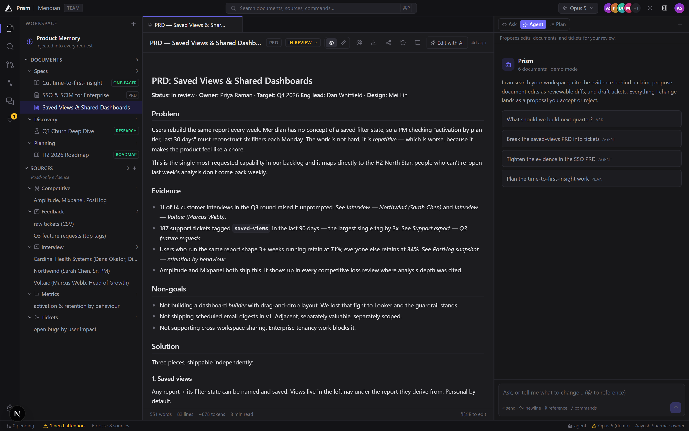
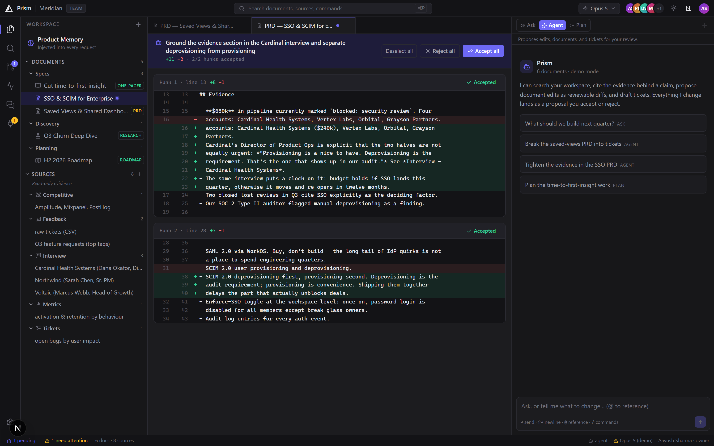

<div align="center">

# Prism (Cursor for PMs)

**The AI workspace for product managers.**
Cursor's interaction model, applied to product decisions instead of code.
### [→ Open the landing page](https://tallystick-one.vercel.app/)

</div>



---

## Table of contents

- [What this is](#what-this-is)
- [The one rule](#the-one-rule)
- [Quick start](#quick-start)
- [Features](#features)
- [Architecture](#architecture)
- [Try these](#try-these)
- [What's verified](#whats-verified)
- [What this does not do](#what-this-does-not-do)
- [Landing page](#landing-page)

---

## What this is

Cursor is a developer tool adapted for PMs, and every complaint about using it
that way traces back to that: no team visibility, no memory between sessions,
integrations that fail silently, and a floor of codebase literacy before any of
it pays off.

Prism keeps the interaction model — the tree, the inline edit, the reviewable
diff — and swaps the substrate. Your repository is your product knowledge.

| In Cursor | In Prism |
| --- | --- |
| File tree over a repo | Workspace tree over documents and evidence |
| `⌘K` inline code edit | `⌘K` inline edit on any PRD paragraph |
| Agent proposes code diffs | Agent proposes **document diffs**, accepted hunk by hunk |
| `.cursorrules` | **Product Memory** — persistent, agent-writable, still reviewed |
| MCP servers that drop silently | Integrations with stored health that refuse loudly |
| Terminal | Ticket composer, pushed to Jira or Linear |

---

## The one rule

> **Every change the AI makes is a proposal.**

Agent edits, `⌘K` rewrites, and updates to Product Memory all travel the same
path: a diff in your editor, accepted or rejected **hunk by hunk**. One mental
model for AI changes, not three — and no code path writes to a document without
either your explicit save or your approval.

That is a compliance property, not a preference. No product org will let an
agent silently rewrite the spec engineering builds from.



Accept two hunks, reject the third: the merged result is recomputed and
recorded, so the audit trail shows what *landed*, not what was offered.

---

## Quick start

```bash
npm install
npm run dev        # → http://localhost:3000
```

No configuration required. The seeded **Meridian** workspace — a fictional B2B
analytics company with a churn problem — comes up with 6 documents and 8
interconnected sources to interrogate.

For real model output instead of the scripted agent:

```bash
echo "ANTHROPIC_API_KEY=sk-ant-..." > .env.local
```

Without a key, a scripted agent runs that still executes **real tool calls** —
searches, edits and ticket batches land in the review queue exactly as the live
model's would. Only the prose is canned, so the whole product stays demoable and
end-to-end testable with no key at all.

---

## Features

### Editor
- Three-pane IDE shell — activity bar, resizable sidebar, tabs, agent panel,
  status bar. Panes auto-collapse to keep the editor usable on small viewports.
- Markdown editor with preview toggle, debounced autosave, dirty indicators.
- **`⌘K` inline edit** — select text, instruct, watch the rewrite stream in as a
  word-level diff, then apply or discard.
- **Per-hunk diff review.** Partial acceptance recomputes the merged document.
- Command palette (`⌘P` quick open, `⌘⇧P` commands), `⌘/` shortcut sheet.

### Data in, work out
- Add sources by paste, file picker, or drag-and-drop. CSV/TSV is parsed with a
  hand-written RFC 4180 parser (quoted fields, embedded commas and newlines) and
  rendered as a real spreadsheet with inferred column types.
- `analyze_source` pivots a tabular source into a crosstab — the severity ×
  frequency matrix a PM would otherwise build by hand.
- Export to Markdown, clipboard, or PDF via a dedicated print stylesheet.
- Revocable, optionally-expiring **share links**. `/s/[token]` renders a
  read-only page with no route back into the workspace.

### Team and trust
- Threaded comments anchored to the quoted passage — stored as text, not
  offsets, so they survive edits above them. Viewers *can* comment.
- Workspace activity feed built on the audit log, so governance and visibility
  can't drift apart.
- **Version history** with snapshots on edit (throttled) and always before an
  accepted AI change. Diff any version against current and restore — restoring
  snapshots first, so it too is undoable.

### The agent
Three modes with genuinely different tool access — **Ask** (read-only),
**Agent** (proposes changes), **Plan** (researches, then writes a plan).
Streaming SSE with live tool cards, `@`-mentions, and clickable citations
carrying verbatim excerpts.

Nine tools: `search_workspace`, `read_entity`, `analyze_source`, `cite`,
`propose_edit`, `create_document`, `draft_tickets`, `generate_status_report`,
`remember`. Tool errors are returned to the model so it can correct itself
rather than failing the turn.

### Platform
Multi-tenant schema where every repository read is workspace-scoped by
construction. Roles (owner/admin/editor/viewer) enforced **server-side** — a
viewer is forced into Ask mode by the API regardless of client state. Audit log,
token usage metering, hashed API keys.

Integration health is stored and checked: a degraded connection **blocks** the
push with a reason rather than reporting a success that never happened.

---

## Architecture

```
src/
  app/api/w/[slug]/…   Workspace-scoped routes (agent + inline-edit stream SSE)
  app/s/[token]/       Public read-only shared document
  lib/
    agent/             prompts · tools · streaming runner · demo agent
    db/                schema · repository · seed
    csv.ts             RFC 4180 parser, type inference, crosstab
    diff.ts            line diff, hunk grouping, word-level pairing
    integrations.ts    provider adapters (check + pushTickets)
    session.ts         auth seam — replace one function to wire a real IdP
  components/          shell · editor · agent · sidebar · panes · palette
  store/               workspace + agent (zustand)
landing/               standalone marketing page, deployable on its own
```

**Stack** — Next.js 15 · React 19 · TypeScript (strict) · Tailwind v4 ·
libSQL/SQLite · Anthropic SDK.

**Data** — a local file by default. Set `DATABASE_URL` + `DATABASE_AUTH_TOKEN`
to point at Turso or any libSQL server; no code changes. Schema, additive
migrations and seed all apply on first connection.

**Auth** — deliberately stubbed in one place. `currentSession` in
`src/lib/session.ts` is the only thing to replace; routes already call
`requireSession`/`requireRole`, so authorisation is enforced at the boundary
rather than sprinkled through handlers.

---

## Try these

| Prompt | Exercises |
| --- | --- |
| *What should we build next quarter?* | Multi-source synthesis, citations, disagreement |
| *Analyse the support CSV — pivot tag by severity* | `analyze_source` → crosstab, two framings |
| *Break the saved views PRD into tickets* | `draft_tickets` → review panel → push |
| *Tighten the evidence in the SSO PRD* | `propose_edit` → diff → per-hunk accept |
| *Write a status report for this week* | `generate_status_report` → new document |

Type `/` in the composer for the same workflows as slash commands.

Also worth doing: select a paragraph and press `⌘K`. Then try pushing a ticket
batch to **Jira** — it's seeded degraded and will refuse, which is the point.
**Reset demo data** in the command palette restores the seeded state.

---

## What's verified

`npm run typecheck` and `npm run build` pass clean. Exercised end-to-end against
a running server:

- Agent streaming with real tool use; `propose_edit` → accept (document written,
  re-accept correctly `409`s)
- Ticket push: degraded provider blocked, healthy provider succeeds, re-push
  blocked
- Share lifecycle: create → fetch → revoke → `404`, with no workspace leakage
- Version history: snapshot on edit, always on accepted AI change, restore
  itself snapshotted
- Ask-mode read-only enforcement, and seven role checks (a viewer can comment
  and read activity, but gets `403` on share, restore, upload, edit and reset)
- **Review-contract audit** — three `updateDocument` call sites, all either an
  explicit user save or behind the review gate, each snapshotting first

---

## What this does not do (In the pipeline)

| | |
| --- | --- |
| **Auth** | No login. The session seam is isolated, but it isn't wired. |
| **Presence** | No live cursors — no websockets. Collaboration is asynchronous. |
| **Concurrency** | Last write wins. Version history means nothing is *lost*, but there is no merge. |
| **Trust** | Uploaded sources are untrusted input reaching a tool-calling model. The review gate contains the blast radius, but prompt injection via a malicious export is a real consideration before ingesting production data. |
| **Vendors** | Integration adapters are stubs. Health checks and the push flow work end to end; no HTTP request leaves the machine. |
| **Tests** | No automated suite. Behaviour was verified by exercising a running server, which caught real bugs — but there is no regression net. |

---

